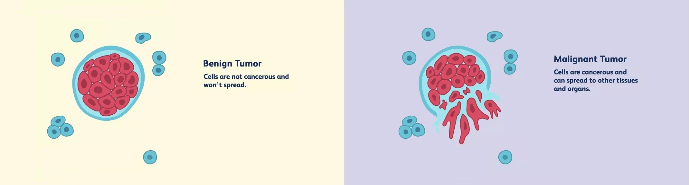

# Breast cancer: **an end-to-end ML project**

## 📖 **About**
The project comes as a deepening of the final work of my Bachelor in Mathematical Engineering @ Politecnico di Milano. It is meant to be a guide to any machine learning classification-project from beginning to end. 

In this repository, I divided the work into three different stages:

* [**part 1** - Exploration of the dataset](https://github.com/PaulinoMoskwa/Breast-Cancer/blob/master/Breast%20Cancer%20-%20pt.%201.ipynb)
* [**part 2** - Dimensionality reduction of the dataset](https://github.com/PaulinoMoskwa/Breast-Cancer/blob/master/Breast%20Cancer%20-%20pt.%202.ipynb)
* [**part 3** - Classification](https://github.com/PaulinoMoskwa/Breast-Cancer/blob/master/Breast%20Cancer%20-%20pt.%203.ipynb)

Each section is self-explainatory and contains all the code to replicate the results.

## 📊 **Dataset**
The breast cancer dataset is a classic and very easy-to-use binary classification dataset. Gathered are various physical information of the breast cells and whether these cells are benign or malignant cancer cells.

The dataset is available on [uci machine learning repository](https://archive.ics.uci.edu/ml/datasets/Breast+Cancer+Wisconsin+%28Diagnostic%29), or on [kaggle](https://www.kaggle.com/datasets/uciml/breast-cancer-wisconsin-data).